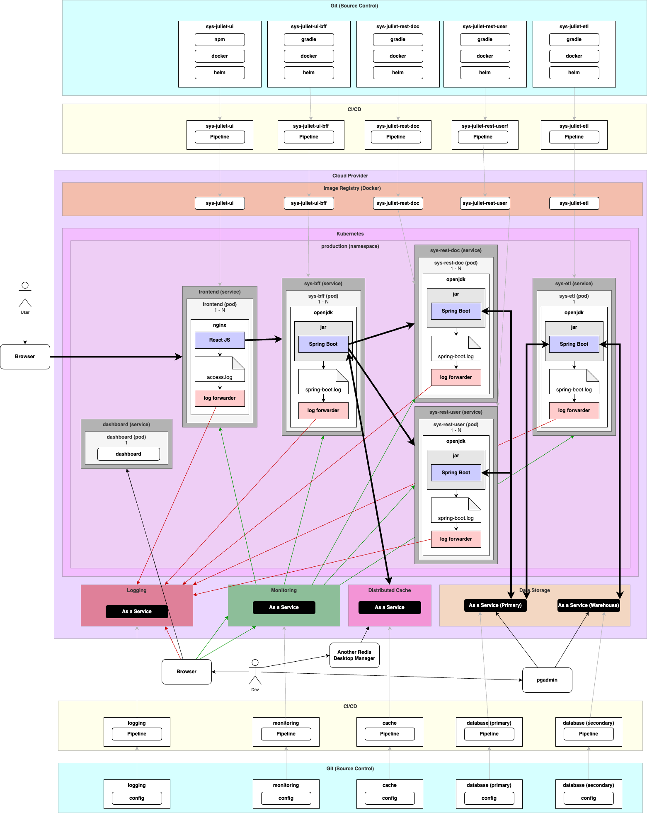
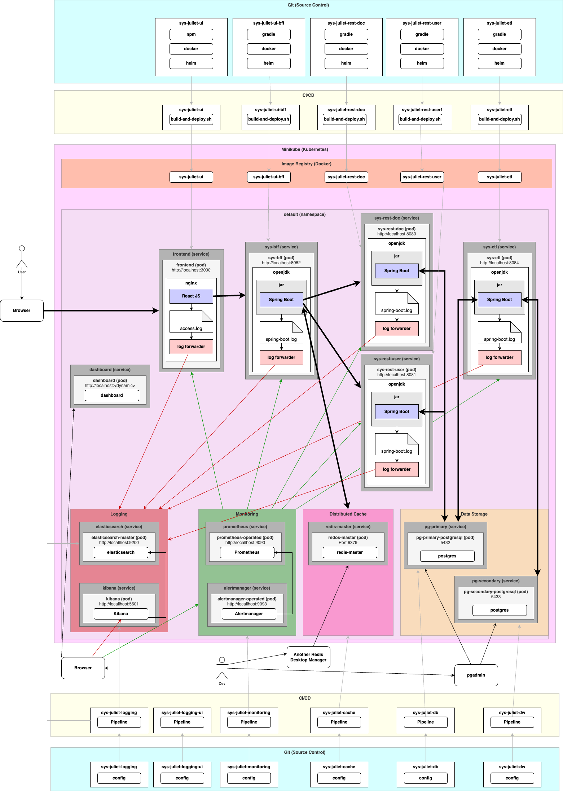
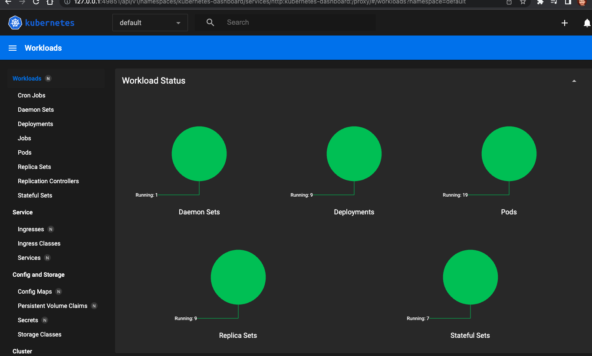

# System Juliet: Microservices on k8s

Prerequisites

- 2-Tier: https://github.com/jvalentino/sys-alpha-bravo
- 2-Tier with Load Balancing: https://github.com/jvalentino/sys-charlie
- 2-Tier with Load Balancing and Database Clustering: https://github.com/jvalentino/sys-delta
- 3-Tier: https://github.com/jvalentino/sys-echo-rest
- 3-Tier with Data Warehousing: https://github.com/jvalentino/sys-foxtrot
- N-Tier on Kubernetes: https://github.com/jvalentino/sys-golf

This is an example system that it used to demonstrate different architectural approaches as they relate to scalability. Its core functions are the following:

- The system shall allow a user to add documents
- The system shall version documents
- The system shall allow a user to download a document

This specific implementation takes our existing system, and moves it to the cloud on containerization:

- The front-end has been broken into its own independent application is separately load balanced.
- The database is clustered (assumed external)
- There is a separate database cluster that functions as long-term storage (assumed external)
- There is an additional backend that is used for handling managing the data warehouse
- Everything is running on the cloud using both a containerization and externalization (SaaS) strategy
- **The backend has been split into 3 separate load balanced applications: RESTful services dedicated to documents, RESTful services dedicated to users, and a Backend dedicated to the Frontend and that makes use of the two series of RESTful services for all operations**

System Components

- Architecture: https://github.com/jvalentino/sys-juliet
- Primary Database: https://github.com/jvalentino/sys-juliet-db
- Secondary Database (Warehousing): https://github.com/jvalentino/sys-juliet-dw
- Distributed Cache: https://github.com/jvalentino/sys-juliet-cache
- Logging: https://github.com/jvalentino/sys-juliet-logging
- Logging Web Portal: https://github.com/jvalentino/sys-juliet-logging-ui
- Monitoring: https://github.com/jvalentino/sys-juliet-monitoring
- Data Warehousing Application (ETL): https://github.com/jvalentino/sys-juliet-etl
- Front-end: https://github.com/jvalentino/sys-juliet-ui
- Backend for the Frontend: https://github.com/jvalentino/sys-juliet-ui-bff
- Document RESTful Services: https://github.com/jvalentino/sys-juliet-rest-doc
- User RESTful Services: https://github.com/jvalentino/sys-juliet-rest-user

# Table of Contents

- [Previous System](#previous-system)
- [Current System](#current-system)
- [Architecture](#architecture)
  * [Key Concepts and Technologies](#key-concepts-and-technologies)
  * [Production](#production)
    + [Source Control (Git)](#source-control-git)
    + [CI/CD](#cicd)
    + [Image Registry](#image-registry)
    + [Kubernetes](#kubernetes)
    + [More SaaS](#more-saas)
  * [Local (Demonstration)](#local-demonstration)
    + [Running it](#running-it)
      - [(1) Start minikube](#1-start-minikube)
      - [(2) Launch the Kubernetes Dashboard](#2-launch-the-kubernetes-dashboard)
      - [(3) Deploy](#3-deploy)
      - [(4) Seed Data](#4-seed-data)
      - [(5) Login](#5-login)
    + [Primary Database](#primary-database)
    + [Cache](#cache)
    + [Secondary Database](#secondary-database)
    + [Logging](#logging)
    + [Logging UI](#logging-ui)
    + [Monitoring](#monitoring)
    + [RESTful Services: Documents](#restful-services-documents)
    + [RESTful Services: Users](#restful-services-users)
    + [UI BFF](#ui-bff)
    + [UI](#ui)
    + [ETL](#etl)


# Previous System

**SaaS (Rating: 10k)**

Use software as a service (SaaS) nearly all the time when available. This is because it significantly reduces your complexity and overhead. For example, you no longer need to be a X-Whatever-Database Clustering Expert, you just use it as a service from your cloud platform. However, where you might have been able to get away having devs logging into 20 or so servers to pull logs and gather metrics, that is no longer an option in this environment. That is because everything is dynamic, meaning it can go away if not in use. This forces you to have to being in:

- Monitoring - To know the health of everything
- Alerting - To know when human intervention is required
- Centralized Logging - To get to the logs in once place

[](https://github.com/jvalentino/clothes-closet-wiki/blob/main/wiki/step-8.png)

Pros

- Backend and Database independent, allowing us have different optimized servers.
- Multple backends allows us to handle more load from users.
- A database cluster removes the database from being the solo bottlekneck.
- Session is maintained in the database, taking it out of memory.
- Separation between backend and frontend allows for slightly more load.
- Data is continually and selectively pruned from the system to mitigate sizing issues.
- Running the applications architecures on an elastic container platform allows them to scale up and down as needed.
- Using database as a service removed the need to deal with the details yourself.

Cons

- Core reliance on RDMS limits upper scalability.

# Current System

**Microservices and BFFs (Rating: 100k)**

Want to do more? Run more stuff in parallel. Considering that most systems have more than one point of graphical interaction, it is helpful to use the BFF pattern, which has a dedicated backend for each front-end. This both alleviates the load on the solo backend application group, but also allows for specific services for specific clients, as it is highly unlikely that the mobile app receives and sends the same data as the web portal, for example. This also allows each BFF to manage its own session independently, and via a distributed cache insteaf of a database because it is significantly faster. Each of these BFFs is also storing its own data in a NoSQL database, which is faster than RBDMS, with the tradeoff being that you have duplicate data (which isn't really a problem).

The other big change is that the single backend application was broken into multiple applications based on service area. This is highly dependent on what the system does, but allows you to scale at a level of granuliaty that was not possible prior.

[](https://github.com/jvalentino/clothes-closet-wiki/blob/main/wiki/step-9.png)

Pros

- Backend and Database independent, allowing us have different optimized servers.
- Multple backends allows us to handle more load from users.
- A database cluster removes the database from being the solo bottlekneck.
- Session is maintained in the database, taking it out of memory.
- Separation between backend and frontend allows for slightly more load.
- Data is continually and selectively pruned from the system to mitigate sizing issues.
- Running the applications architecures on an elastic container platform allows them to scale up and down as needed.
- Using database as a service removed the need to deal with the details yourself.
- Highly granular scaling possible.
- Usage of BFF caching and NoSQL greatly increases scalability.

Cons

- Reliance on RDMS limits upper scalability.

# Architecture

## Key Concepts and Technologies

- Cloud Provider
- SaaS
- PaaS
- Image Registry
- Containerization
- Kubernetes
- Helm
- Docker
- Monitoring & Alerting
- Centralized Logging
- Backend for Front-end (BFF)
- Microservices

## Production

With a now core reliance on Cloud with a focus on SaaS, the Production implementation is going to look a little different (with respect to Dev/Prod Parity) than our Development environments. This is largely do to that we get to a point where one can't run the entire system locally anymore due to its size, and thus work on a system in parts. Specifically, you don't expect the average developer to be running the entire monitoring stack locally, however someone working on the monitoring stack would need to.

Consider that that when it comes to infrastructure like monitoring, logging, alerting, and data storage, the first rule of the cloud is "don't". More specifically, don't get in the business of hosting this stuff yourself, and instead rely on what your cloud provider has as SaaS. This is a tradeoff between cost and maintenance, being that implementing and maintain these infrastructures can be incredibly complicated, and generally require teams unto themselves.

The resulting production architecture look like this:



### Source Control (Git)

The basis of any system is source control, where every component is expected to be its own repository. As this is infrastructure, it is highly recommended that you rely on a third-party to provide your Git hosting, for example GitHub.com, bitbucket.com, etc. The reasoning is the same for the rest of infrastructure: setup, hosting, and maintenance is complicated and generally requires a dedicated team. That may not seem like much at first, but with all the new infrastructure we are adding it can quickly get out of control: Cloud First.

The specific expected repositories are:

- **sys-juliet-ui** - The codebase for the ReactJS based UI, which uses an NPM build system, contains a Dockerfile for representing the container used for running it, Helm configurations for deploying it onto Kubernetes, and then the Pipeline as code for managing it all on the CI/CD system.
- **sys-juliet-ui-bff** - The codebase for the Spring Boot based backend for the front-end. It uses the Gradle build system, contains a Dockerfile for representing the container used for running it, the Helm configurations for deploying it onto Kubernetes, and then the Pipeline as Code for managing it all on the CI/CD system.
- **sys-juliet-rest-doc** - The codebase for the Spring Boot based backend for RESTful services involving documents. It uses the Gradle build system, contains a Dockerfile for representing the container used for running it, the Helm configurations for deploying it onto Kubernetes, and then the Pipeline as Code for managing it all on the CI/CD system.
- **sys-juliet-rest-user** - The codebase for the Spring Boot based backend for RESTful services involving users. It uses the Gradle build system, contains a Dockerfile for representing the container used for running it, the Helm configurations for deploying it onto Kubernetes, and then the Pipeline as Code for managing it all on the CI/CD system.
- **sys-juliet-etl** - The codebase for the Spring Boot based ETL, or the thing that manages the data warehouse. It uses the Gradle build system, contains a Dockerfile for representing the container used for running it, the Helm configurations for deploying it onto Kubernetes, and then the Pipeline as Code for managing it all on the CI/CD system.
- **logging** - Because the logging is handled via SaaS, the purpose of this project is to contain the minimal configuration needed for setting it up and maintain it. This is always technology specific, but there will always be some minimal configuration and at least a single command-line thing to handle it.
- **monitoring** - Because the monitoring is handled via SaaS, the purpose of this project is to contain the minimal configuration needed for setting it up and maintain it. This is always technology specific, but there will always be some minimal configuration and at least a single command-line thing to handle it.
- **database (primary)** - Because the database is handled via SaaS, the purpose of this project is to contain the minimal configuration needed for setting it up and maintain it. This is always technology specific, but there will always be some minimal configuration and at least a single command-line thing to handle it.
- **database (secondary)** - Because the database is handled via SaaS, the purpose of this project is to contain the minimal configuration needed for setting it up and maintain it. This is always technology specific, but there will always be some minimal configuration and at least a single command-line thing to handle it.
- **cache** - Because the distributed cache is handled via SaaS, the purpose of this project is to contain the minimal configuration needed for setting it up and maintain it. This is always technology specific, but there will always be some minimal configuration and at least a single command-line thing to handle it.

### CI/CD

CI/CD in this context refers to the technology used to automate build, test, and deployment. As with the "Cloud First" principle, you want to avoid hosting this yourself at almost all costs. Tools like Jenkins can get extremely complicated when dealing with even mid-level scale, resulting in the need for having a dedicated team just for a single tool. Instead of having yet another dedicated team for yet another tool, it is instead recommended to leverage SaaS solutions such as Github Actions, BitBucket Pipelines, etc.

- **sys-juliet-ui** - One or more pipelines for testing, building, and delivering the frontend application, the first of which is triggered on any code change to any branch.
- **sys-juliet-ui-bff** - One or more pipelines for testing, building, and delivering the REST services, the first of which is triggered on any code change to any branch.
- **sys-juliet-rest-doc** - One or more pipelines for testing, building, and delivering the REST services, the first of which is triggered on any code change to any branch.
- **sys-juliet-rest-user** - One or more pipelines for testing, building, and delivering the REST services, the first of which is triggered on any code change to any branch.
- **sys-juliet-etl** - One or more pipelines for testing, building, and delivering the ETL application, the first of which is triggered on any code change to any branch.
- **logging** - One or pipelines for managing whatever the SaaS centralized logging requires, which should be minimal.
- **monitoring** - One or pipelines for managing whatever the SaaS centralized monitoring requires, which should be minimal.
- **database (primary)** - One or pipelines for managing whatever the SaaS primary database requires, which should be minimal considering the schema is already automatically managed by the REST application.
- **database (secondary)** - One or pipelines for managing whatever the SaaS secondary database requires, which should be minimal considering the schema is already automatically managed by the ETL application.
- **cache** - One or more pipelines for managing whatever the SaaS cache requires, which should be minimal.

### Image Registry

Because the core of our system is containerization, it is inevitable that we are going to have to generate and then store our own container (Docker Images). Specifically in this case, where are using a custom nginx container for the frontend and two different custom OpenJDK containers for the Spring Boot applications. To be able to pull them for usage in any containerization technology like Kubernetes, it is recommended that you use the registry provided by your cloud, for example ECR on AWS.

### Kubernetes

Instead of having to worry about load balancers, scaling, and container coordination, Kubernetes if a platform that manages this all for you. It is best to think of it as:

- **Cluster** - An abstract group of computing resources that are capable of running containers.
- **Namespaces** - A grouping of services, for example one for dev, one for prod, or sometimes it is best to have different namespaces for different aspects like logging.
- **Services** - An abstraction for running one or more pods.
- **Pods** - The actual underlying container, as orchestrated by a single service.

Since the commands and configuration for running things on Kubernetes can get complicated, it Is common to use Helm as a templating framework for managing the pages and pages of YAML for defining the Kubernetes runtimes.

In our production namespace we are running services for the following:

- **sys-ui** - Which is the running of our **sys-juliet-ui** project via its Docker image, which additionally has a log forwarder built into that image to sending logs to a central location.
- **sys-ui-bff** - Which is the running of our **sys-juliet-ui-bff** project via its Docker image, which additionally has a log forwarder built into that image to sending logs to a central location.
- **sys-rest-doc** - Which is the running of our **sys-juliet-rest-doc** project via its Docker image, which additionally has a log forwarder built into that image to sending logs to a central location.
- **sys-rest-user** - Which is the running of our **sys-juliet-rest-user** project via its Docker image, which additionally has a log forwarder built into that image to sending logs to a central location.
- **sys-etl** - Which is the running of our **sys-juliet-etl** project via its Docker image, which additionally has a log forwarder built into that image to sending logs to a central location.

### More SaaS

In following the theme of "Cloud First" as we did for the Image Registry, CI/CD, and the hosting of Kubernetes itself, we are are relying on SaaS for our non-applications, specifically:

- **logging** - The recommendation is to use whatever the cloud provider offers, and if that is not sufficient there are other centralized solutions such as New Relic, Sumo Logic, etc.
- **monitoring** - The recommendation is to use whatever the cloud provider offers, and if that is not sufficient there are other centralized solutions such as New Relic, Dynatrace, etc.
- **Data storage** - The recommendation is to always use what the cloud provider offers, due latency (and cost) of attempting to store data outside of a specific cloud. A good example would be RDS on AWS.
- **Cache** - This refers to use of a distributed cache used by the UI BFF for managing user session. The recommendation is to use whatever the cloud provider offers.

## Local (Demonstration)

When it comes to demonstrating this system outside of production, and mostly because it is not cost effective for me to spin a large system up on AWS or Azure, I have the desired architecture running one instance of every locally. This is done by using Minikube as the local Kubernetes platform. Additionally, instead of running monitoring and logging and SaaS, I have set it up as well to run locally to both demonstrate what it looks like and give a taste of why you may not want to be maintaining those on your own.



### Running it

Prerequisites

- git
- node
- java
- docker desktop
- IntelliJ
- pgadmin
- psql
- minikube
- helm
- Redis
- Another Redis Desktop Manager

To install the above automatically, please use https://github.com/jvalentino/setup-automation.

#### (1) Start minikube

A script was provided to start Minikube with expanded memory and processing power:

```
./start-minikube.sh
```

Specifically that runs `minikube start --cpus 4 --memory 6144` because we are going to be running quite a bit of things.

#### (2) Launch the Kubernetes Dashboard

The following will run a temporary pod for the visual Kubernetes interface:

```
minikube dashboard
```

It will also automatically open a new browser window with it:

[](https://github.com/jvalentino/sys-golf/blob/main/wiki/03.png)

There will be nothing running though.

#### (3) Deploy

This requires that you have all the other projects locally at the same level as this project:

- Primary Database: https://github.com/jvalentino/sys-juliet-db
- Secondary Database (Warehousing): https://github.com/jvalentino/sys-juliet-dw
- Distributed Cache: https://github.com/jvalentino/sys-juliet-cache
- Logging: https://github.com/jvalentino/sys-juliet-logging
- Logging Web Portal: https://github.com/jvalentino/sys-juliet-logging-ui
- Monitoring: https://github.com/jvalentino/sys-juliet-monitoring
- Data Warehousing Application (ETL): https://github.com/jvalentino/sys-juliet-etl
- Front-end: https://github.com/jvalentino/sys-juliet-ui
- Backend for the Frontend: https://github.com/jvalentino/sys-juliet-ui-bff
- Document RESTful Services: https://github.com/jvalentino/sys-juliet-rest-doc
- User RESTful Services: https://github.com/jvalentino/sys-juliet-rest-user

```bash
./start.sh
```

This script will build and deploy in order every piece of the architecture.

You know it is working when you see lots of green circles on the Kubernetes dashboard:



#### (4) Seed Data

The following commands will set the state of both the primary and secondary database, and more specifically so you can log in using admin/37e098f0-b78d-4a48-adf1-e6c2568d4ea1

```
./gradlew deleteWarehouseDb loadMainDb
```

#### (5) Login

If it all worked, you can hit the main page at [http://localhost:3000](http://localhost:3000/)

[](https://github.com/jvalentino/sys-golf/blob/main/wiki/17.png)

...and login using admin/37e098f0-b78d-4a48-adf1-e6c2568d4ea1

[](https://github.com/jvalentino/sys-golf/blob/main/wiki/19.png)

### Primary Database

Reference: https://github.com/jvalentino/sys-juliet-db

This project represents Postgres Database as run on Kubernetes via Helm, as a part of the overall https://github.com/jvalentino/sys-juliet project. For system details, please see that location.

Postgres

> PostgreSQL, also known as Postgres, is a free and open-source relational database management system emphasizing extensibility and SQL compliance. It was originally named POSTGRES, referring to its origins as a successor to the Ingres database developed at the University of California, Berkeley

https://en.wikipedia.org/wiki/PostgreSQL

Kubernetes Dashboard

It will show on the Dashboard as a "Stateful Set" because this specific service involve storing data on the file system.

[](https://github.com/jvalentino/sys-golf/raw/main/wiki/06.png)

pgadmin

You can then verify it is working by using pgadmin:

[](https://github.com/jvalentino/sys-golf/blob/main/wiki/05.png)

### Cache

Reference: https://github.com/jvalentino/sys-juliet-cache

This project represents Redis distributed caching as run on Kubernetes via Helm, as a part of the overall https://github.com/jvalentino/sys-juliet project. For system details, please see that location.

Redis

> Redis (Remote Dictionary Server) is an open-source in-memory data structure project implementing a distributed, in-memory key-value database with optional durability. Redis supports different kinds of abstract data structures, such as strings, lists, maps, sets, sorted sets, hyperloglogs, bitmaps, streams and spatial indexes.

https://en.wikipedia.org/wiki/Redis

Kubernetes Dashboard

[](https://github.com/jvalentino/sys-juliet-cache/blob/main/wiki/redis-k8s.png)

Another Redis Desktop Application

[](https://github.com/jvalentino/sys-juliet-cache/blob/main/wiki/redis.png)

If the BFF is not connected, there will be no data but you can at least connect to it.

Host: localhost

Port: 6379

### Secondary Database

Reference: https://github.com/jvalentino/sys-juliet-dw

This project represents Postgres Data warehouse as run on Kubernetes via Helm, as a part of the overall https://github.com/jvalentino/sys-juliet project. For system details, please see that location.

Postgres

> PostgreSQL, also known as Postgres, is a free and open-source relational database management system emphasizing extensibility and SQL compliance. It was originally named POSTGRES, referring to its origins as a successor to the Ingres database developed at the University of California, Berkeley

https://en.wikipedia.org/wiki/PostgreSQL

Kubernetes Dashboard

It will show on the Dashboard as a "Stateful Set" because this specific service involve storing data on the file system.

[](https://github.com/jvalentino/sys-golf/blob/main/wiki/07.png)

pgadmin

You can then verify it is working by using pgadmin:

[](https://github.com/jvalentino/sys-golf/blob/main/wiki/08.png)

### Logging

Reference: https://github.com/jvalentino/sys-juliet-logging

This project represents Elasticsearch as run on Kubernetes via Helm, as a part of the overall https://github.com/jvalentino/sys-juliet project. For system details, please see that location.

Elasticsearch

> Elasticsearch is a search engine based on the Lucene library. It provides a distributed, multitenant-capable full-text search engine with an HTTP web interface and schema-free JSON documents. Elasticsearch is developed in Java and is released as open source under the terms of the Apache License. Official clients are available in Java, .NET (C#), PHP, Python, Apache Groovy, Ruby and many other languages. According to the DB-Engines ranking, Elasticsearch is the most popular enterprise search engine followed by Apache Solr, also based on Lucene.

https://en.wikipedia.org/wiki/Elasticsearch

Kubernetes Dashboard

Since ES involves storage, it will show as a Stateful Set if it is working:[ ](https://github.com/jvalentino/sys-golf/blob/main/wiki/09.png)

Cluster Health

The health endpoint can be reached at http://localhost:9200/_cluster/health?pretty, where we expect it to be yellow because we only have one instance:

```
{
  "cluster_name" : "elasticsearch",
  "status" : "yellow",
  "timed_out" : false,
  "number_of_nodes" : 1,
  "number_of_data_nodes" : 1,
  "active_primary_shards" : 12,
  "active_shards" : 12,
  "relocating_shards" : 0,
  "initializing_shards" : 0,
  "unassigned_shards" : 3,
  "delayed_unassigned_shards" : 0,
  "number_of_pending_tasks" : 0,
  "number_of_in_flight_fetch" : 0,
  "task_max_waiting_in_queue_millis" : 0,
  "active_shards_percent_as_number" : 80.0
}
```

General Information

The root page will also give you general cluster information at [http://localhost:9200](http://localhost:9200/)

```
{
  "name" : "elasticsearch-master-0",
  "cluster_name" : "elasticsearch",
  "cluster_uuid" : "I8YhfPVWQ5iik9D7zVOiKA",
  "version" : {
    "number" : "8.5.1",
    "build_flavor" : "default",
    "build_type" : "docker",
    "build_hash" : "c1310c45fc534583afe2c1c03046491efba2bba2",
    "build_date" : "2022-11-09T21:02:20.169855900Z",
    "build_snapshot" : false,
    "lucene_version" : "9.4.1",
    "minimum_wire_compatibility_version" : "7.17.0",
    "minimum_index_compatibility_version" : "7.0.0"
  },
  "tagline" : "You Know, for Search"
}
```

Index Health

http://localhost:9200/_cat/indices is useful to see what all index information is being put in elastic search, which when all the applications are running will look like this:

```
yellow open sys-rest-doc  8WyyN3YGSFCSRj8cm8iyQg 1 1 320634 0  24.3mb  24.3mb
yellow open sys-ui-bff    CyfNZhXpRJKwJLknRrex2A 1 1  63185 0   6.6mb   6.6mb
yellow open sys-rest-user rABrzJhHSTWtnOzPp_TAIA 1 1    930 0     2mb     2mb
yellow open sys-etl       WrL-Ma9JQEuU697zS0nRRg 1 1   1095 0   3.7mb   3.7mb
yellow open sys-ui        mm-1egv7R5ehRKAayJjNbA 1 1  12364 0 609.6kb 609.6kb
```

### Logging UI

Reference: https://github.com/jvalentino/sys-juliet-logging-ui

This project represents Kibana Web UI run on Kubernetes via Helm, as a part of the overall https://github.com/jvalentino/sys-juliet project. For system details, please see that location.

Kibana

> Kibana is an open source data visualization plugin for Elasticsearch. It provides visualization capabilities on top of the content indexed on an Elasticsearch cluster. Users can create bar, line and scatter plots, or pie charts and maps on top of large volumes of data.

https://en.wikipedia.org/wiki/Kibana

f it is working, you can see regular pod for Kibana:

[](https://github.com/jvalentino/sys-golf/blob/main/wiki/10.png)

If it worked, you can access the application at [http://localhost:5601](http://localhost:5601/)

[](https://github.com/jvalentino/sys-juliet-logging-ui/blob/main/wiki/kibana.png)

You will specifically see the index for each individual application runtime:

- sys-ui-bff - The UI BFF
- sys-etl - The ETL application
- sys-rest-user - The RESTful services related to the user
- Sys-ui - The React frontend on nginx
- Sys-rest-doc - The RESTful services related to documents

### Monitoring

Reference: https://github.com/jvalentino/sys-juliet-monitoring

This project represents the Prometheus-based monitoring stack as run on Kubernetes via Helm, as a part of the overall https://github.com/jvalentino/sys-juliet project. For system details, please see that location.

**Prometheus**

> Prometheus is an open-source systems monitoring and alerting toolkit originally built at SoundCloud. Since its inception in 2012, many companies and organizations have adopted Prometheus, and the project has a very active developer and user community. It is now a standalone open source project and maintained independently of any company. To emphasize this, and to clarify the project's governance structure, Prometheus joined the Cloud Native Computing Foundation in 2016 as the second hosted project, after Kubernetes.

https://prometheus.io/docs/introduction/overview/

**Alertmanager**

> The Alertmanager handles alerts sent by client applications such as the Prometheus server. It takes care of deduplicating, grouping, and routing them to the correct receiver integration such as email, PagerDuty, or OpsGenie. It also takes care of silencing and inhibition of alerts.

https://prometheus.io/docs/alerting/alertmanager/

Runtime (Prometheus)

You can tell that it is both running and working, by hitting http://localhost:9090/targets, where you will see a ton of endpoints being monitoring:

[](https://github.com/jvalentino/sys-juliet-monitoring/blob/main/wiki/targets.png)

Runtime (Alert Manager)

You can tell that the Alertmanager is running by hitting http://localhost:9093/:

[](https://github.com/jvalentino/sys-juliet-monitoring/blob/main/wiki/alert-manager.png)


### RESTful Services: Documents

Reference: https://github.com/jvalentino/sys-juliet-rest-doc

This application serves as the restful services as part of the overall https://github.com/jvalentino/sys-juliet project as they relate to documents. For system level details, please see that location.

The Swagger UI can then be accessed via http://localhost:8080/swagger-ui/index.html

[](https://github.com/jvalentino/sys-juliet-rest-doc/blob/main/wiki/swagger-1.png)

You are then going to want to set the authorization code to `123`, otherwise access will be defined. That is our default/testing API Key.

[](https://github.com/jvalentino/sys-juliet-rest-doc/blob/main/wiki/authorize.png)

[](https://github.com/jvalentino/sys-juliet-rest-doc/blob/main/wiki/xauth.png)

### RESTful Services: Users

Reference: https://github.com/jvalentino/sys-juliet-rest-user

This application serves as the restful services as part of the overall https://github.com/jvalentino/sys-juliet project as they relate to Users. For system level details, please see that location.

The Swagger UI can then be accessed via http://localhost:8081/swagger-ui/index.html

[](https://github.com/jvalentino/sys-juliet-rest-user/blob/main/wiki/swagger-1.png)

You are then going to want to set the authorization code to `123`, otherwise access will be defined. That is our default/testing API Key.

[](https://github.com/jvalentino/sys-juliet-rest-user/blob/main/wiki/authorize.png)

[](https://github.com/jvalentino/sys-juliet-rest-user/blob/main/wiki/xauth.png)

### UI BFF

Reference: https://github.com/jvalentino/sys-juliet-ui-bff

This application serves as the BFF for the UI as part of the overall https://github.com/jvalentino/sys-juliet project as they relate to documents. For system level details, please see that location.

The Swagger UI can then be accessed via http://localhost:8082/swagger-ui/index.html

[](https://github.com/jvalentino/sys-juliet-ui-bff/blob/main/wiki/swagger-1.png)

This RESTful services represent exactly the original endpoints from the previous single backend called https://github.com/jvalentino/sys-golf-rest

Consider that / and /custom-login are the only unprotected endpoints, and the rest of the endpoints require you to be logged in. The following will explain how to login and then set the appropriate authorization headers.

### UI

Reference: https://github.com/jvalentino/sys-juliet-ui

This application serves the UI as a part of the overall https://github.com/jvalentino/sys-juliet project. For system details, please see that location

If it all worked, you can hit the main page at [http://localhost:3000](http://localhost:3000/)

[](https://github.com/jvalentino/sys-golf/blob/main/wiki/17.png)

...and login using admin/37e098f0-b78d-4a48-adf1-e6c2568d4ea1

[](

### ETL

Reference: https://github.com/jvalentino/sys-juliet-etl

This application serves the function of taking data from the main database and using it to populate a database used for data warehousing as a part of the overall https://github.com/jvalentino/sys-juliet project. For system details, please see that location.

This will then be accessible via [http://localhost:8084](http://localhost:8084/), which gives a status page:

[](https://github.com/jvalentino/sys-juliet-etl/blob/main/wiki/8081.png)


